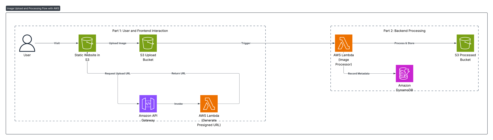

# 📌 Project 3: Serverless REST API with DynamoDB and API Gateway

## 📖 Overview
This project demonstrates how to build a **serverless REST API** using **AWS Lambda, Amazon API Gateway, and DynamoDB** to manage data such as a simple to-do list or customer records.  
The architecture ensures **scalability, high availability, and cost efficiency** by leveraging AWS managed services without managing any servers.  

The application provides a front-end hosted in **Amazon S3** and exposes REST API endpoints through **Amazon API Gateway**, backed by **AWS Lambda** for request handling and **Amazon DynamoDB** for persistent data storage.

Live link: http://manara-app-1234567890.s3-website-us-east-1.amazonaws.com

---

## 🏗️ Solution Architecture

### **Architecture Components**
1. **Amazon S3 (Frontend Hosting)**
   - Hosts the static front-end website that interacts with the backend APIs.
   - Users can upload and view data records.

2. **Amazon API Gateway**
   - Exposes REST API endpoints for CRUD (Create, Read, Update, Delete) operations.
   - Serves as the entry point for all client requests.

3. **AWS Lambda**
   - Stateless functions to handle API requests.
   - Performs CRUD logic (insert, fetch, update, delete).
   - Integrates directly with DynamoDB.

4. **Amazon DynamoDB**
   - NoSQL database to store user records (e.g., to-do tasks or customer details).
   - Provides low-latency data access with automatic scaling.

5. **Amazon CloudWatch**
   - Collects logs and metrics for monitoring Lambda and API Gateway.
   - Helps troubleshoot API errors and performance issues.

6. **AWS IAM**
   - Defines roles and permissions for API Gateway, Lambda, and DynamoDB access.
   - Secures the overall architecture.

---

## ⚙️ Features
- **Serverless REST API**: CRUD operations without managing infrastructure.
- **Scalable**: Fully managed by AWS, scales automatically with demand.
- **Low Cost**: Pay only for execution time and storage usage.
- **Stateless Execution**: API requests handled independently by Lambda.
- **Monitoring & Logging**: Enabled via CloudWatch.
- **Secure Access**: IAM roles and policies restrict unauthorized access.

---

## 📂 API Endpoints
| Method | Endpoint               | Description                  |
|--------|------------------------|------------------------------|
| POST   | `/items`              | Create a new record          |
| GET    | `/items`              | Fetch all records            |
| GET    | `/items/{id}`         | Fetch a record by ID         |
| PUT    | `/items/{id}`         | Update a record by ID        |
| DELETE | `/items/{id}`         | Delete a record by ID        |

---

## 🚀 Deployment Steps
1. **Frontend Setup (S3)**
   - Upload your static website files to an **S3 bucket**.
   - Enable **static website hosting** in bucket properties.

2. **Backend Setup**
   - Create a **DynamoDB table** (e.g., `ToDoItems` with `id` as partition key).
   - Deploy **Lambda functions** for CRUD operations.
   - Configure **API Gateway** with methods and integrate with Lambda.

3. **Security & Permissions**
   - Assign IAM roles to Lambda functions for DynamoDB access.
   - Configure API Gateway with proper authentication/authorization if required.

4. **Monitoring**
   - Use CloudWatch for logs, metrics, and alarms.

---

## 📊 Learning Outcomes
- Designing **scalable event-driven applications** with AWS serverless stack.
- Implementing **API Gateway + Lambda** for REST APIs.
- Using **DynamoDB** as a fully managed NoSQL solution.
- Securing APIs with **IAM roles and resource policies**.
- Monitoring and troubleshooting with **CloudWatch**.

---

## ✅ Next Steps
- Add **authentication** using AWS Cognito or API keys.
- Implement **request validation** in API Gateway.
- Optimize DynamoDB with **secondary indexes** for advanced queries.
- Use **S3 + Lambda** for storing attachments/files alongside records.

